# Overview

I have outlined and analyzed the solution to the devops-task in the text below. I hope I understood the assignment.
Искам и да благодаря за вниманието и отделеното време.

## First things first

I knew I had a lingering kubernetes context from when I was deploying kubeadm via Ansible to AWS so I wanted to double-check.

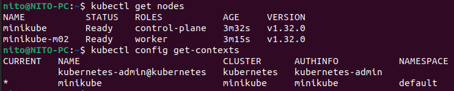

After installing minikube i gave my m02 node a superficial label of "worker", then switched the context (which is done automatically, though) and was ready to go.

### But why did I chosse Minikube?

* Well, it's one of the oldest and most well-established local Kubernetes solutions with a rich documentation and user base which is priceless when everything starts **imagepullbackoff**-ing.

* Also I know Minikube is VM-based while **k3d** and **kind** run Kubernetes nodes as Docker containers if I'm not mistaken. I often prefer better isolation and a more production-like environment for my projets because I also know that my PC can handle the extra load (my GPU survived New World and the first few months of Cyberpunk 2077 on DLSS Performance profile).

### The Terraform/FluxCD Core

At the beginning I was thinking how many components would be possible to deploy via Terraform only. I checked the documentation for the FluxCD Operator which was provided to me in the task's brief and found that I could at least deploy the actual Operator with the following version: 


I made the whole TF configuration more modular as I am still fresh from my last infrastructure project where I wrote about 15 different TF files. I also checked Stefan Prodan's repository - https://github.com/controlplaneio-fluxcd/flux-operator/tree/main/config/terraform to see if I'm not missing some crucial statement or variable (this is the first time I am using anything Flux related but I have used ArgoCD before). All in all, I deploy the Flux Operator, which gives my cluster the ability to manage Flux. Then I create a "flux_instance" which is a request to the operator to create a properly configured FluxCD installation:

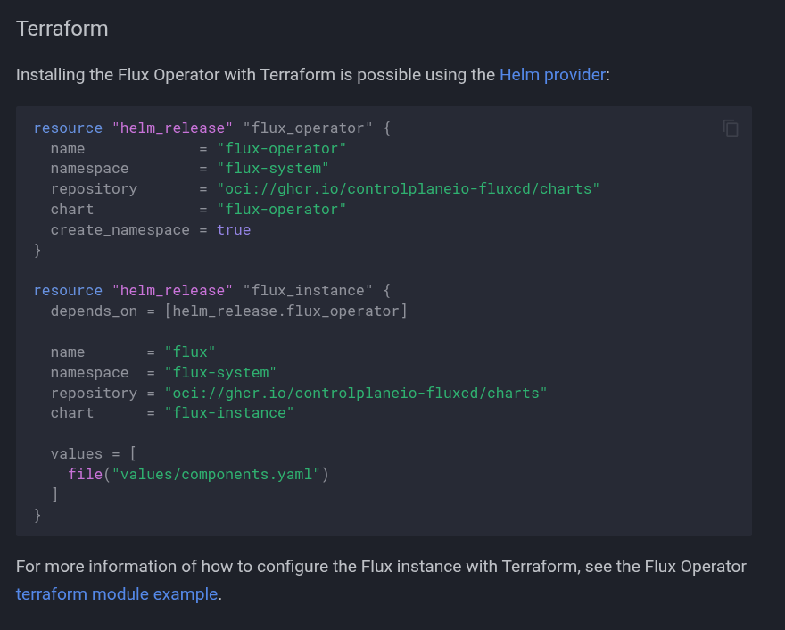

I applied the terraform configuration and created the following resources: 

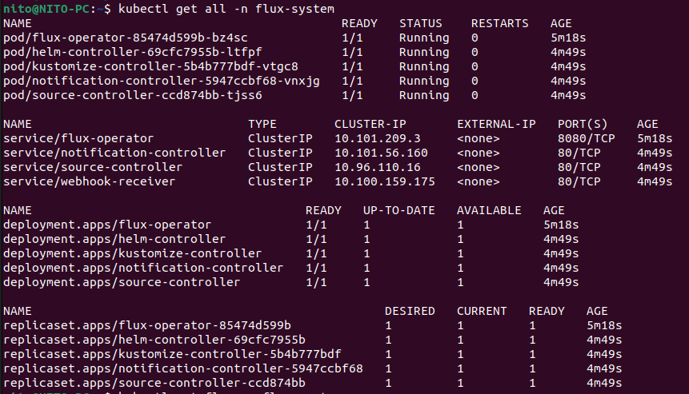

### Approach to Synchronization and Resources

Here's how the sync intervals work together in my configuration:

* Every **minute**, Flux checks for new commits in the Git repository via the gitrepository.yaml. If there are, it downloads them.
* Every **10 minutes**, the Kustomization controller checks if it needs to apply any changes from the most recent Git state to the cluster. This happens regardless of when the last Git update was fetched (important!).
* Every **5 minutes**, HelmReleases check if the current Helm release match what's specified in Git.
* Every **hour**, HelmRepositories check if there are new chart versions available in the upstream repositories.

I don't know if it's a good approach but it sounds alright for now. Additionally, while the reason why I have so many commits in this project might look like it's because I relied entirely on FluxCD to immediately demonstrate the changes... it's not like that. I often used a simple **kubectl apply -f** and the name of the desired file to quickly patch-up a version.

Also, I thought that Kustomize controller had something to do with Kustomize but it was far more interesting than that.
So this Kustomize thing is orchestrating the deployment of all my Kubernetes resources across my five different namespace and handles all of the complex relationships between them.

- So it ensures Redis is running before OneTimeSecret tries to connect to it
- makes sure Vault and External Secrets are operational before attempting to create registry credentials
- confirmes that Nexus is available before pulling the OneTimeSecret image even though I explicitly make it available via 
```
kubectl port-forward svc/nexus-docker -n nexus 5000:5000
```

### Helm Charts

I got reminded about the way Helm charts are moving away from a custom and somewhat convoluted repository format to the standardized OCI (Open Container Initiative) approach that I am using just for my Redis chart here. OCI repositories now apparently store Helm charts as container images and in the exact same registries that store my Docker images. This means a Helm chart is now just another type of container image. I am saying all of this because I had trouble getting Redis' old helm chart to work and eventually I had to set-up a fancy modern OCI one.

I managed to dig up a NON-OCI helm chart for nexus from https://github.com/stevehipwell/helm-charts 

For Vault and ESO I didn't have any issues.

*To sum-up, I have used 4 official Helm charts - Vault, nexus3, ESO and Redis and raw Kubernetes manifests to configure the onetimesecret app.*


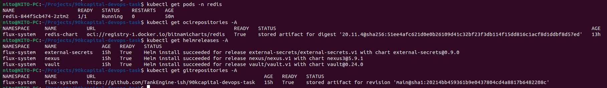


### Nexus & The Secrets

I managed to set-up Vault to store my nexus and redis credentials.

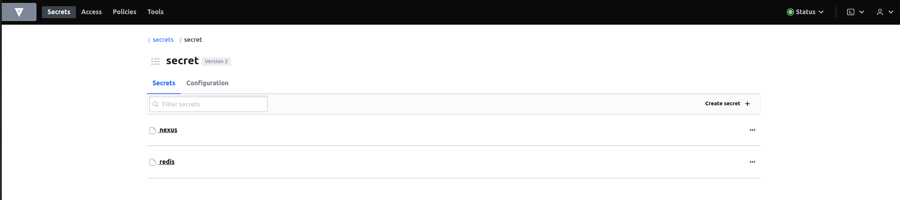

And their values:

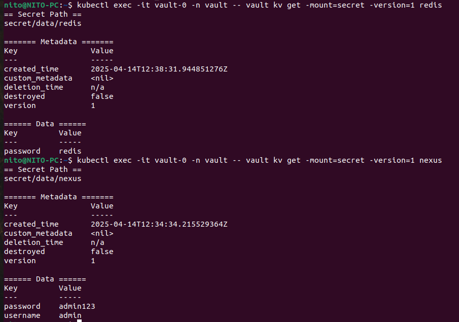

As I understand it, the External Secrets resource act as a bridge, translating Vault secrets into Kubernetes secrets. And because Docker requires credentials to be in JSON format and Base64 encoded it uses the Go templateing syntax (which you can find in my regcred.yaml file) for conversion. The *data* section in the regcred file  establishes the actual mapping between Vault's secrets and the template variables. It tells External Secrets Operator to fetch the "username" property from the "nexus" secret in Vault and make it available as ".username" in my template. The regcred is then automatically referenced in my OneTimeSecret deployment via the imagePullSecrets field in the deployment.yaml in my onetimesecret folder.

```
imagePullSecrets:
- name: regcred
```

The best thing about all of this is that when I need to rotate the Nexus registry password, I only need to update it in Vault. ESO automatically detects this change during its 15-minute refresh cycle and updates the Kubernetes secret accordingly. The applications seamlessly receive the new credentials without any deployment changes or restarts and the sensitive content remains protected in the secrets management tool.

As for setting up the Nexus repository: 

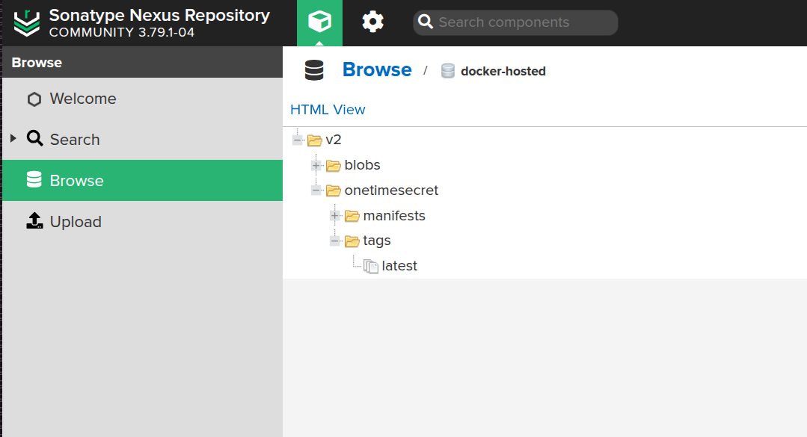


And the actual settings I used:

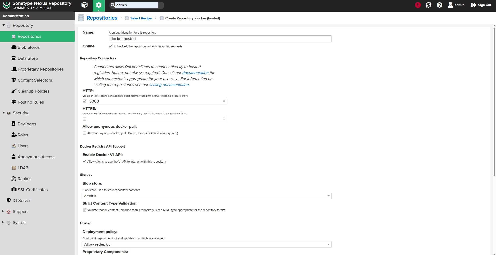


Now, some talk about port-forwarding - I needed to port-forward to the Nexus registry on port 5000 because it is running inside the Kubernetes cluster with an internal address (10.103.64.91:5000) that's only accessible from within the cluster network. However, when pushing the OneTimeSecret image, I was running the Docker command on my local machine, which exists outside this network.

So the command


created a network tunnel that bridged this gap. When active, this tunnel intercepted any traffic sent to localhost:5000 on my machine and forwarded it to the Nexus registry inside the cluster. This allowed the local Docker client to communicate with the in-cluster registry as if it were running locally.
Without this port forwarding, the Docker push command would have no way to reach the registry inside the cluster. I had some "context deadline exceeded" errors which probably happened because I was trying to push directly to the cluster IP.


### The OneTimeSecret Application

In short the OneTimeSecret App:

* Consumes credentials from Vault via External Secrets Operator
* Pulls its container image from the Nexus registry
* Stores and retrieves data from Redis
* Exposes itself to the world (well, localhost) through Kubernetes services


# The Solution

### Intro: 

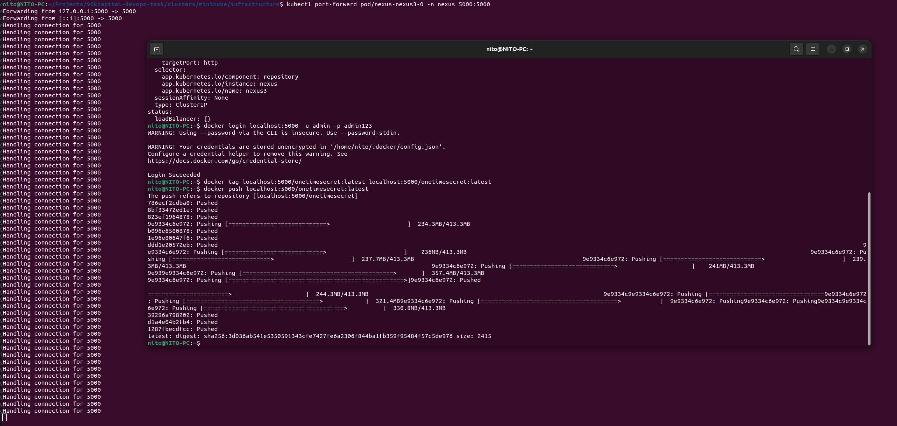

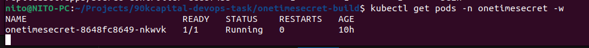

### First Part: 


### Second Part: 

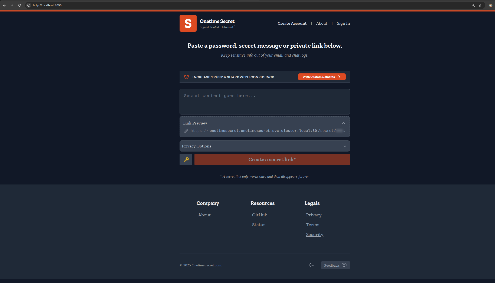

### Third Part: 

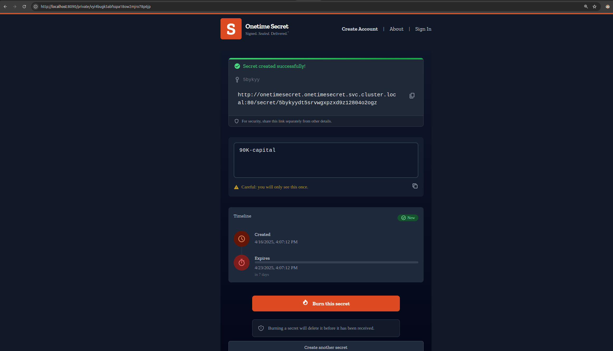

I also wanted to check if the secrets were correctly being saved to my Redis.

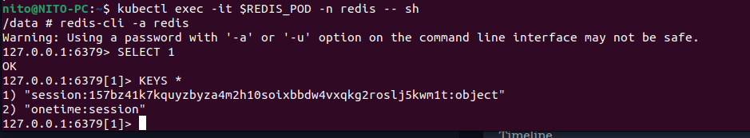


# Things That Need Attention: 

- Clean-up my Redis folder. I don't think I need the manual methods for deployment of Redis via the deployment.yaml, pvc.yaml and service.yaml. I can only keep namespace.yaml, release.yaml and the oci-repositories.yaml. Preserve the modern Helm OCI methodology.

- I need to make my terraform more modular by splitting the main.tf in maybe 4 other files like: 

├── providers.tf       
├── variables.tf       
├── flux.tf            
├── outputs.tf         
and put it all away in a directory 

- Sort out the hardcoded virtual IP that was generated by the minikube's control plane. Should use the DNS name instead. So go from this: 
```
image: 10.103.64.91:5000/onetimesecret:latest
```

to this:

```
image: nexus-docker.nexus.svc.cluster.local:5000/onetimesecret:latest
```

- I could also use version tags instead of "latest".


# Допълнителни въпрос/и

1. Бих избрал ***blue-green***

Стратегията позволява zero downtime, което значи, че новата версия се пуска, докато старата си върви (на приблизително 20% от базата потребители се пуска), в отделна среда (т.нар. „зелена“). След като се уверим, че новата (зелена) версия работи коректно (с помощта на health checks, тестове и безброй други неща), трафикът се пренасочва към нея. Ако възникне проблем, връщането (rollback) към старата версия (blue) е почти мигновено, без да е необходимо повторно build-ване или rollout.

2. Първо да кажа, че промени в production знам, че е най-добре да бъдат избягвани, но ако бъдат хипотетично наложителни може би ще следват този принцип:

Класическият начин е като всички промени в production се правят чрез Git pull requests към main (но не само, в един от моите проекти Jenkins създава временен branch за code review) branch. Правилният екип прави code review и одобрение на промените. След merge в определения branch, GitOps инструментът (дали flux или argo) синхронизира състоянието на production с Git репото.

И самият процес по промяна ако се използва blue-green би изглеждал може би нещо такова:

* Новият Docker image се build-ва и се тагва.

* Deployment конфигурацията се обновява в Git.

* Flux/Argo прави rollout на новата версия в „зелена“ среда.

* Извършват се автоматични проверки, валидации, тествания и прочие.

* Ако всичко е наред – трафикът се пренасочва към новата среда.

* В случай на проблем – връщане към старата версия (blue) чрез rollback.


